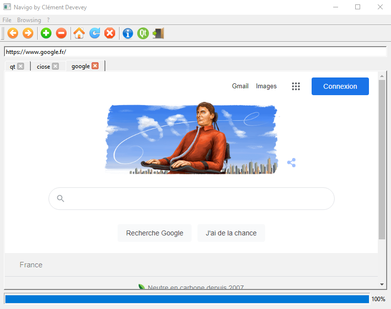

# Navigo
Navigo (web browser) made by myself, following the openclassroom tutorial

This web browser can : 
- open and close tabs.
- refresh, go to home, cancel loading.
- go to the specified URL (by pressing return key)
  - without http:// or https://, it will go for a google search.
- set name for each tab according to the website. (for instance, visiting https://www.google.fr/ will set google.
- show the progress of loading.

Here is how does it look like :

